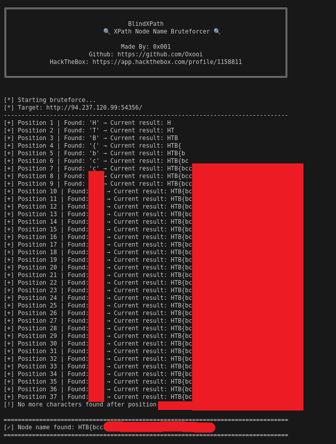
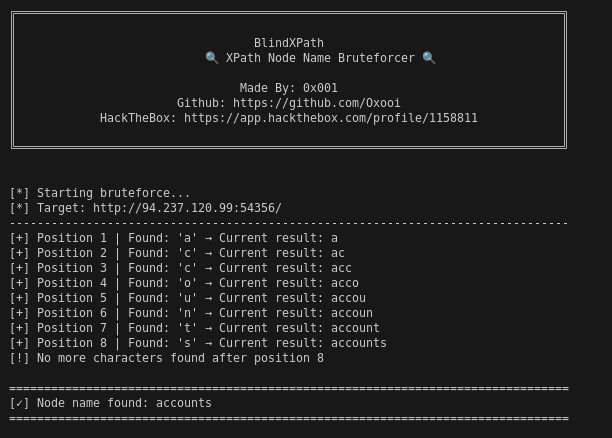

# 🥷 XPathNinja

Advanced XPath Injection exploitation toolkit for penetration testing and CTF challenges.

## ✨ Features

- 🎯 **Classic Extraction**: Direct node name discovery
- ⏱️ **Time-Based Blind**: Exploit time delays for data exfiltration
- 🔢 **Node Counting**: Enumerate XML structure
- 🚀 **Fast & Efficient**: Optimized bruteforce algorithms
- 🔧 **Burp Integration**: Built-in proxy support for debugging

## 📸 Screenshots





## 🚀 Quick Start
```bash
git clone https://github.com/Oxooi/XPathNinja.git
cd XPathNinja
pip install -r requirements.txt
python xpath_ninja.py
```

## 🎓 Made for

- HackTheBox challenges
- Bug bounty hunting
- Penetration testing
- Security research

# ⚠️ Disclaimer
**For educational purposes only. Always obtain proper authorization before testing.**

Made with 💀 by 0x001